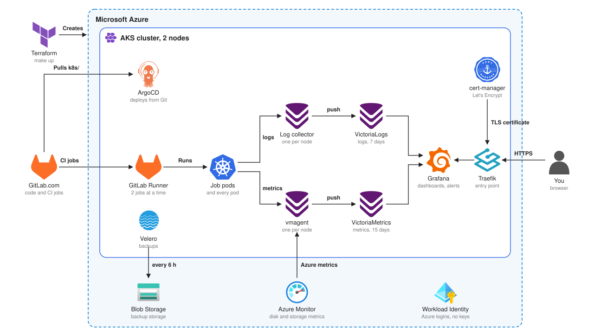

<div align="center">
<br/>
<h1>GitLab Runners on AKS</h1>

<br/>
<br/>
<i>A production-ready Kubernetes cluster that runs GitLab CI jobs, watched by VictoriaMetrics, VictoriaLogs and Grafana, backed up by Velero, and deployed by ArgoCD</i>
<br/>
<br/>
<sub>Contributors</sub>
<br/>
<br/>
<a href="https://github.com/WhiteMuush"></a>
</div>

<br/>

---

<br/>

The cluster runs GitLab CI jobs for every team. It is built to be watched and repaired quickly:

- **metrics** of every component, stored in a VictoriaMetrics cluster;
- **logs** of every pod, `kube-system` included, stored in VictoriaLogs;
- **dashboards** and **alerts** in Grafana, reachable over HTTPS;
- **backups** of the cluster resources with Velero, in Azure Blob Storage.

Everything is code: Terraform creates the Azure side, ArgoCD deploys everything inside the cluster from this repository.

## Repositories

- **GitLab** (main repository, merge requests, CI): https://gitlab.com/WhiteMuush/gitlab-runner-on-azure
- **GitHub** (copy): https://github.com/Melvin-Simplon/gitlab-runner-on-azure

## How it works

The platform has 3 jobs:



1. **Run the CI jobs.** The GitLab Runner takes jobs from GitLab.com and runs each one as a pod.
2. **Watch the cluster.** An agent on each node sends the metrics and the logs of every pod to VictoriaMetrics and VictoriaLogs. Grafana shows them, with the alerts, over HTTPS.
3. **Back up the cluster.** Velero saves every Kubernetes resource to Azure every 6 hours.

## What runs in the cluster

| Component | Role | Namespace |
|---|---|---|
| GitLab Runner | Runs the CI jobs as pods, 2 at a time | `gitlab-runner` |
| VictoriaMetrics cluster | Stores the metrics, 35 days (vminsert, vmselect, 2 vmstorage) | `monitoring` |
| vmagent | Reads the metrics on each node and pushes them | `monitoring` |
| node-exporter | CPU, memory, disk and network of each node | `monitoring` |
| kube-state-metrics | State of the pods, deployments and nodes | `monitoring` |
| VictoriaLogs | Stores the logs, 7 days | `monitoring` |
| VictoriaLogs collector | Reads the logs of every pod on each node | `monitoring` |
| vmalert and Alertmanager | Check the alert rules and group the alerts | `monitoring` |
| Grafana | Dashboards, logs and alerts, over HTTPS | `monitoring` |
| azure-metrics-exporter | Reads the Azure metrics of the disks and the storage account | `azure-metrics` |
| Velero | Backs up the cluster resources | `velero` |
| Traefik | Entry point from the Internet | `traefik` |
| cert-manager | Gets and renews the HTTPS certificate | `cert-manager` |
| ArgoCD | Deploys everything above from Git | `argocd` |

The GitLab Runner pod also has a **vmagent sidecar**: it reads the runner metrics and pushes them like the others.

## Requirements

- An Azure subscription, with **Owner** on the resource group and **Role Based Access Control Administrator** on the subscription. The second one lets Terraform give the exporter read access to the AKS node resource group.
- A GitLab account and a token with the `api` scope, for the Terraform state.
- These tools: `az`, `terraform` (1.10 or newer), `kubectl`, `kubelogin`, `make`, `jq`, `curl`.
- For `make lint` only: `shellcheck`, and `tflint` if you have it.

## First install

1. Copy `.env.example` to `.env`, then fill it in. Git ignores `.env`.
2. Log in to Azure:
   ```bash
   az login
   ```
3. Give the Azure roles to the cluster admins, once:
   ```bash
   make bootstrap
   ```
4. Create everything:
   ```bash
   make up
   ```
   It applies the 3 Terraform stacks, gets your `kubectl` access, then pushes the runner token and the Grafana password into the cluster.
5. Wait a few minutes for ArgoCD to deploy the apps, then check:
   ```bash
   make status
   ```

## Daily use

Type `make` alone to open an interactive menu, or `make help` to list every target.

| Command | What it does |
|---|---|
| `make start` | Starts the stopped cluster |
| `make stop` | Stops the cluster, the nodes are no longer billed |
| `make status` | Checks everything in one pass, in color |
| `make alerts` | Lists the alerts that fire now |
| `make backups` | Lists the Velero backups |
| `make top` | CPU and memory of the nodes and of the hungriest pods |
| `make grafana-password` | Shows the Grafana URL, login and password |
| `make argocd-ui` | Opens the ArgoCD UI on https://localhost:8080 |
| `make kubeconfig` | Gets `kubectl` access with your Entra account |
| `make plan` | Shows what Terraform would change |
| `make destroy` | Removes everything, then asks if the backups must go too |
| `make lint` | Checks the Terraform code and the scripts |

Grafana is at https://gitlab-runner-mpetit.francecentral.cloudapp.azure.com.

## Azure side (Terraform)

Terraform is split into 3 stacks. Their state is stored in GitLab.

| Stack | What it creates | Destroyed by `make destroy` |
|---|---|---|
| `terraform/backup` | The storage account for the Velero backups | Only if you type `y` |
| `terraform/infra` | The AKS cluster and the Azure identities of Velero and of the exporter | Yes |
| `terraform/bootstrap` | ArgoCD, the root app, and the service accounts linked to the Azure identities | Yes |

The backup stack is separate, so the backups can survive the cluster.

## Inside the cluster (ArgoCD)

ArgoCD watches `k8s/apps/` in this repository. Each file there is one app: an official Helm chart plus its settings from `k8s/<app>/values.yaml`.

To change something in the cluster, change the file, open a merge request and merge it. ArgoCD applies it within 30 seconds.

## Observability

**Metrics** collected:

- every platform component (ArgoCD, Traefik, cert-manager, Grafana, VictoriaMetrics, VictoriaLogs, Velero, vmalert);
- nodes (node-exporter, kubelet) and pods (kube-state-metrics, cAdvisor);
- GitLab Runner;
- Azure: disks and backup storage account.

**Logs** of every pod, `kube-system` included. In Grafana, open **Explore**, pick **VictoriaLogs**, and filter with `kubernetes.pod_namespace:"kube-system"`.

**Dashboards**, in 3 Grafana folders:

| Folder | Dashboards |
|---|---|
| Kubernetes | Global, Namespaces, Nodes, Pods, Node Exporter Full |
| Observability | VictoriaMetrics cluster, vmagent, VictoriaLogs, VictoriaLogs collector |
| Platform | ArgoCD, Traefik, cert-manager, Velero, GitLab Runner, SLO |

**SLO**: the Runner SLO dashboard answers one question: do we have working runners, all the time? It follows 4 objectives over 30 days. The definitions, the alerts and the error budget policy are in [docs/slo.md](docs/slo.md).

| Objective | Target | Measured with |
|---|---|---|
| Runner is reachable | 99 % | minutes where the runner answers, no data counts as down |
| Runner talks to GitLab | 99 % | runner API calls without a 5xx code |
| Jobs are not broken by the runner | 99 % | failed jobs, without failing scripts and canceled jobs |
| Jobs start within 60 seconds | 95 % | time a job waits before a runner takes it |

Each objective shows its SLI, the error budget left, and the burn rate. The dashboard comes from `k8s/grafana/dashboards/slo.json` on `main`, so Grafana needs a restart to load a new version.

**Alerts**: 23 alert rules in `k8s/vmalert/rules.yaml`, on the nodes, the pods, the platform, the backups and the runner SLOs, plus 33 recording rules that compute the SLOs. They show in Grafana, menu **Alerting**. When one problem fires several alerts, Alertmanager hides the consequences and keeps the cause.

## Backups

- Velero saves every Kubernetes resource every 6 hours, and keeps each backup 7 days.
- The most useful part: the runner token and the Grafana password are Secrets that are not in Git, so only the backup can bring them back.
- Disk contents are not saved. The metrics and logs are history, not configuration.

## Security

- **No Azure key anywhere.** Velero and the exporter log in to Azure with Workload Identity. The storage account has its access keys turned off.
- **Least privilege.** Velero can only write in its storage account. The exporter can only read metrics.
- **No admin kubeconfig.** People log in with their Entra ID account.
- **No secret in Git.** The runner token and the Grafana password come from `.env`, through `make`.
- **HTTPS** from the Internet to Grafana, with a Let's Encrypt certificate.

## Limits

- The cluster has **2 Standard_D2s_v3 nodes** (4 vCPU in total), because the vCPU quota is shared by the whole class. In a real setup, the runners would get their own node pool with autoscaling.
- Traffic between pods inside the cluster is plain HTTP.

## Repository layout

```
Makefile            entry point, includes makefiles/
makefiles/          make targets, one file per topic
scripts/            the scripts behind each target
terraform/          backup, infra and bootstrap stacks
k8s/apps/           one ArgoCD app per component
k8s/<component>/    the Helm values of each component
docs/               project brief, SLO definitions
```

## Contributing

`main` is protected:

1. Create a branch from `main`
2. Open a merge request on GitLab
3. Resolve every discussion, then merge (Maintainers only)

Direct pushes and force pushes to `main` are blocked.

## Documentation

- [Project brief](docs/consignes.md)
- [Runner SLOs](docs/slo.md)
- [ArgoCD](https://argo-cd.readthedocs.io/)
- [AKS Workload Identity](https://learn.microsoft.com/en-us/azure/aks/workload-identity-overview)
- [GitLab Runner Helm chart](https://docs.gitlab.com/runner/install/kubernetes/)
- [VictoriaMetrics Helm charts](https://docs.victoriametrics.com/helm/)
- [vmagent](https://docs.victoriametrics.com/victoriametrics/vmagent/)
- [vmalert](https://docs.victoriametrics.com/victoriametrics/vmalert/)
- [Alertmanager](https://prometheus.io/docs/alerting/latest/alertmanager/)
- [VictoriaLogs](https://docs.victoriametrics.com/victorialogs/)
- [VictoriaLogs collector (vlagent)](https://docs.victoriametrics.com/victorialogs/vlagent/)
- [VictoriaLogs Grafana plugin](https://docs.victoriametrics.com/victorialogs/integrations/grafana/)
- [Grafana](https://grafana.com/docs/grafana/latest/)
- [Alerting on SLOs (Google SRE workbook)](https://sre.google/workbook/alerting-on-slos/)
- [Traefik](https://doc.traefik.io/traefik/)
- [cert-manager](https://cert-manager.io/docs/)
- [node-exporter](https://github.com/prometheus/node_exporter)
- [kube-state-metrics](https://github.com/kubernetes/kube-state-metrics)
- [Kubernetes system metrics (kubelet, cAdvisor)](https://kubernetes.io/docs/concepts/cluster-administration/system-metrics/)
- [Velero](https://velero.io/docs/)
- [Velero plugin for Microsoft Azure](https://github.com/vmware-tanzu/velero-plugin-for-microsoft-azure)
- [azure-metrics-exporter](https://github.com/webdevops/azure-metrics-exporter)
- [Azure Monitor supported metrics](https://learn.microsoft.com/en-us/azure/azure-monitor/reference/supported-metrics/metrics-index)
